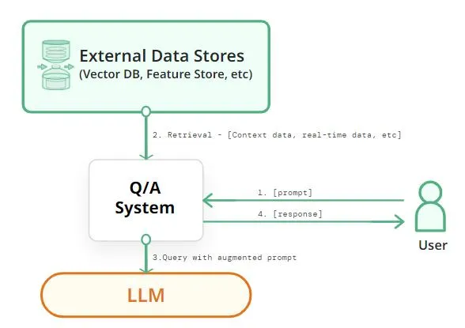

# RAG AI Assistant: A Document-Focused Query Tool

<p align="center">
  
</p>

## 1. Project Overview

This project is a powerful yet straightforward Retrieval-Augmented Generation (RAG) application designed to answer questions about a codebase or a collection of documents. It serves as an experimental tool for anyone interested in learning about:

- **Retrieval-Augmented Generation (RAG):** Understand the core concepts of RAG, where a language model's knowledge is augmented with custom data to provide more accurate and context-aware responses.
- **Interfacing with Model APIs:** See how to interact with different large language model (LLM) providers, including local models via Ollama and high-performance cloud APIs like Groq.
- **Indexing:** Learn how to process, chunk, and index source code and documents to create a searchable knowledge base using vector embeddings.

This application demonstrates how to combine file processing, vector databases, and LLMs to create a practical, useful assistant.

## 2. Setup and Installation

### Prerequisites

- Python 3.8 or higher
- `pip` for package management

### Clone the Repository

```bash
git clone https://github.com/NassAbd/rag_app.git
cd rag_app
```

### Install Dependencies

```bash
pip install -r requirements.txt
```

### Configure API Keys and Services

The application supports both local and cloud-based models.

**For Local Models (Ollama):**

1.  **Install Ollama:** If you haven't already, download and install Ollama from the [official website](https://ollama.com/).
2.  **Download a Model:** Pull a model to use with the application. I recommend starting with a smaller model like `gemma:2b`.
    ```bash
    ollama run gemma:2b
    ```
    The application will automatically detect any models you have downloaded via Ollama.

**For Cloud Models (Groq):**

1.  **Get a Groq API Key:** Sign up for a free account on the [Groq website](https://console.groq.com/keys) and create an API key.
2.  **Create a `.env` file:** In the root of the project directory, create a new file named `.env`.
3.  **Add Your API Key:** Add your Groq API key to the `.env` file like this:
    ```
    GROQ_API_KEY="your-api-key-here"
    ```
    The application uses the `python-dotenv` library to load this key automatically.

## 3. Usage Instructions

Once the setup is complete, you can run the application using Streamlit.

### Run the Application

Navigate to the project's root directory in your terminal and run the following command:

```bash
streamlit run app.py
```

This will open the application in a new tab in your web browser.

### Upload Files

1.  Click the **"Browse files"** button in the "Add files to the knowledge base" section.
2.  Select one or more files (`.py`, `.txt`, `.md`, `.pdf`, `.docx`, etc.) that you want the assistant to have knowledge about.
3.  The application will automatically save the files to the `code_docs` folder and begin indexing them. Wait for the "Indexing finished" success message.

### Select a Model

1.  Use the **"Choose a model provider"** dropdown to select either `ollama` (for local models) or `groq` (for cloud-based models).
2.  Based on your selection, the **"Choose a model"** dropdown will populate with available models. Select the one you wish to use.

### Ask a Question

1.  Type your question about the files you uploaded into the text area under **"Ask question about your files..."**.
2.  Click the **"Submit prompt"** button.
3.  The model's response will appear below. You can also expand the **"See the context added to your prompt"** section to see the exact information that was retrieved from your files and provided to the model.

## 4. Key Features

- **Multi-File Format Support:** Index and query a variety of file types, including `.py`, `.md`, `.txt`, `.pdf`, and `.docx`.
- **Automatic Indexing:** The knowledge base is updated automatically whenever you add or delete files via the UI.
- **Multi-Provider Model Selection:** Seamlessly switch between local models (via Ollama) and fast cloud-based APIs (via Groq).
- **Dynamic Model Loading:** The application dynamically fetches the list of available models from the selected provider.
- **Context Transparency:** For every answer, you can view the exact context that was retrieved from your files and passed to the language model, offering insight into the RAG process.
- **Vector Search:** Uses FAISS, a vector search library, to quickly find relevant information in your documents.
- **Caching:** The indexer is optimized to only re-process new or modified files, saving time and computational resources.

## 5. Notes for Learners

This project is designed to be a launchpad for my own experiments. Here are a few ideas on what you can learn and how you can extend the project:

- **Experiment with Different Models:** The multi-provider setup makes it easy to compare the performance, speed, and response quality of different local and cloud-based models. (e.g., How does `llama3-8b-8192` from Groq compare to a local `gemma:2b`?)
- **Understand the Prompt:** Use the "See the context added to your prompt" expander to understand how the retrieved text influences the model's answer. This is the core of the RAG technique.
- **Modify the Indexer:** Dive into `indexer.py`. Can you change the chunking strategy? Try different sentence-transformer models to see how it affects retrieval quality.
- **Add New File Types:** Extend the `extract_text_from_file` function in `indexer.py` to support other file formats, like `.csv` or `.jsonl`.
- **Try a Different Vector Store:** The project uses FAISS, but you could swap it out for another vector database like ChromaDB or LanceDB.
